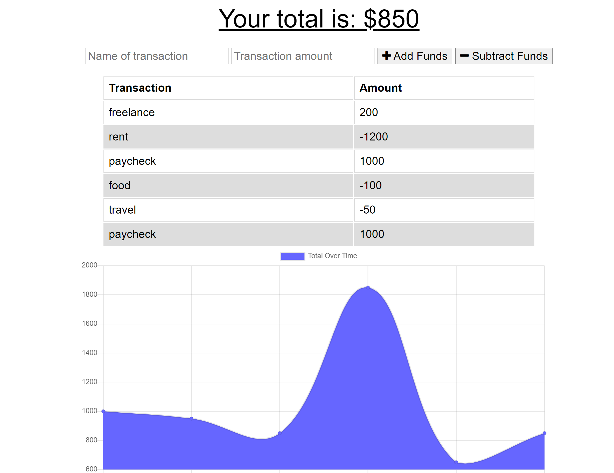

# Budget Tracker
  

> This application allows a user to track their income and expenses with or without an internet connection.

## Table of contents
* [General info](#general-info)
* [Screenshots](#screenshots)
* [Technologies](#technologies)
* [Setup](#setup)
* [Features](#features)
* [To-Do](#to-do)
* [Status](#status)
* [Inspiration](#inspiration)
* [Licenses](#licenses)
* [Contact](#contact)

## General info
Since internet access is not always possible, especially while traveling, this application allows the user to monitor their expenses when needed then update when the internet is accessible again.

## Screenshots


## Technologies
* HTML5
* CSS3
* JavaScript
* node.js
* MongoDB Atlas
* IndexedDB

## Setup
> https://glacial-plateau-64449.herokuapp.com/

## Code Examples
Show examples of usage:
```
mongoose.connect(process.env.MONGODB_URI || 'mongodb://localhost/budget-tracker', {
  useFindAndModify: false,
  useNewUrlParser: true,
  useUnifiedTopology: true});
```

## Features
* User can enter deposits offline
* User can enter expenses offline
* When internet connection is restored this information will update properly

## To-Do
* Add dates
* Connect to personal calendar
* Connect to personal bank account

## Status
This project is in progress.  As new technologies and client needs evolve, so will this application.

## Inspiration
In an ever changing world involving traveling, this application allows a user to continue working even when internet access is not available.

## Licenses
[](https://opensource.org/licenses/ISC)  

## Contact
Created by [Jason Fletcher](blueink38@yahoo.com) - feel free to contact me!